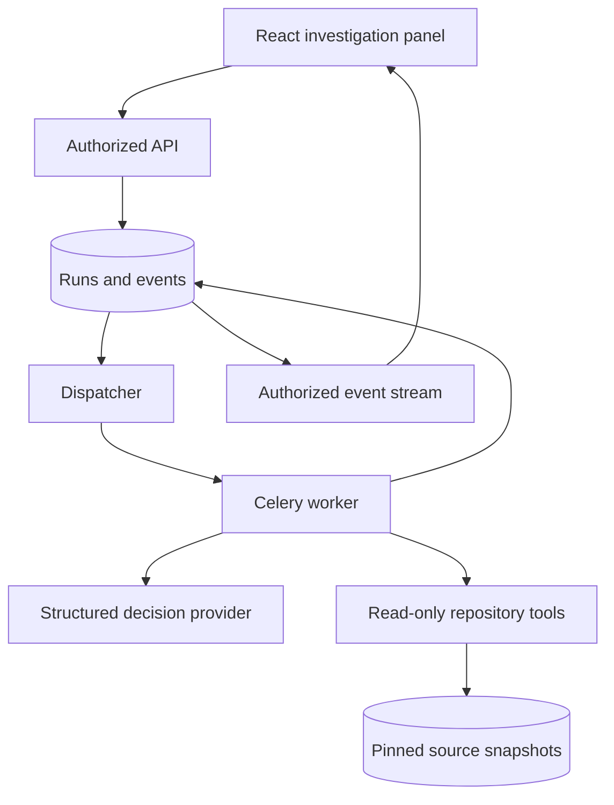

# Milestone 8 — read-only investigation agent

Milestone 7 was reported complete by the user. This milestone implements investigation
only; Milestone 9 plans/patch proposals and Milestone 10 execution remain untouched.

## Outcome and architecture

In a named conversation, you can ask the agent to investigate code. It creates a short
public action plan, chooses controlled tools, observes returned source evidence, and
finishes with cited findings or an explicit insufficient-evidence answer. The timeline,
usage receipts and result survive reloads. It cannot execute code or modify the repository.



The important engineering separation: the model proposes a typed action; application code
controls permission, inputs, execution and output limits. Instructions alone do not create
a security boundary. A small explicit loop demonstrates orchestration without adding a
framework dependency. See ADR 0013 for tradeoffs and bounds.

Investigations are saved under their conversation but have independent results. They do
not append Q&A messages or enter conversational memory. Each task is self-contained;
include the function/file you want investigated instead of relying on implicit chat history.

## Implementation parts and paths

1. Contracts and model boundary: backend/app/agents/contracts.py, agents/provider.py,
   agents/prompts/investigation_v1.txt. AgentProvider is replaceable; strict JSON decisions
   contain a public plan and exactly one action or final answer. No hidden reasoning field.
2. Tools and loop: backend/app/agents/tools.py and agents/engine.py. The four typed tools
   receive server-bound ownership and source IDs, never IDs selected by the model.
3. Persistence: backend/app/models/agent.py, repositories/agent.py,
   migrations/versions/0012_investigations.py. Durable state, event ordering and call usage.
4. Background processing: backend/app/jobs/agent_run.py, agent_dispatcher.py, celery_app.py
   and dispatcher.py. Five-call budget, lease fencing, cancellation and queue recovery.
5. API: backend/app/schemas/agent.py, services/agents.py, services/agent_stream.py,
   api/routes/agents.py and api/routes/agent_events.py; registered in app/main.py.
6. React: frontend/src/features/agent/api.ts, events.ts, AgentPanel.tsx and AgentRunView.tsx;
   integrated in frontend/src/features/conversations/ConversationWorkspace.tsx.
7. Evaluation: backend/app/evaluation/agents.py and evaluation/agents/v1/cases.json.
8. Tests/config: backend/tests/unit/test_agent.py, test_agent_evaluation.py,
   backend/tests/api/test_agents.py, test_agent_tools.py,
   backend/tests/integration/test_agent_postgres.py, frontend/tests/agent.test.tsx,
   backend/app/core/config.py, .env.example, docker-compose.yml and CI workflow.

The complete exact patch and docs/milestone-8-files.txt list every changed path. No new
library dependency. Existing model, HTTP, database, queue and React dependencies suffice.

## Database change

The additive 0012 migration creates:

| Table | Purpose and constraints |
| --- | --- |
| agent_runs | Conversation FK with cascade, request key unique per conversation, partial unique index allowing one active investigation, dispatch index on status/created_at |
| agent_events | Composite primary key (run_id, sequence), cascading run FK, sequence 1–32; appended while the run write lock is held |
| agent_calls | Composite primary key (run_id, step), cascading run FK, step 1–5, frozen decimal prices, nullable usage/cost constrained to be all unknown or all nonnegative |

Pinned source index and commit metadata are retained without a source FK so completed
snapshot results survive reindexing. Ownership comes from the conversation/repository join.
The migration contains frozen PostgreSQL DDL, not runtime imports of mutable ORM models.
Rollback drops investigation data; do not downgrade unless you intend that data loss.

## Upgrade and run

Commit/back up your existing Milestone 7 project. Extract this archive separately and
copy UPGRADE_FROM_MILESTONE_7.patch to your existing repopilot-ai root. From that root:

```bash
cd repopilot-ai
git apply --check UPGRADE_FROM_MILESTONE_7.patch
git apply UPGRADE_FROM_MILESTONE_7.patch
```

Success: exit 0. This patch targets the exact delivered 7C3/completed-Milestone-7 source.
If local edits conflict, stop and inspect the named file; the archive contains complete
final source. Do not overwrite your .env, Git history or persistent DB volume.

In your existing .env, configure:

```dotenv
APP_AGENTS_ENABLED=true
APP_AGENT_DAILY_REQUEST_LIMIT=20
```

Set APP_OPENAI_API_KEY to your own key if absent. Keep it private. The agent reuses
APP_ANSWER_MODEL, APP_ANSWER_MAX_OUTPUT_TOKENS, APP_ANSWER_INPUT_PRICE_PER_MILLION and
APP_ANSWER_OUTPUT_PRICE_PER_MILLION. Check those rates before interpreting estimates.
APP_ANSWERS_ENABLED is independent; semantic embeddings are not required. With the agent
flag false, the UI explains that investigations are disabled. Enabled agents without a
key fail configuration clearly.

From repopilot-ai root:

```bash
docker compose stop frontend backend worker dispatcher
docker compose build
docker compose up -d postgres redis
docker compose run --rm migrate alembic upgrade head
docker compose run --rm migrate alembic current
docker compose run --rm migrate alembic check
docker compose up -d
docker compose ps -a
```

Expected: 0012_investigations (head), no schema drift, migration exit 0, healthy backend/
PostgreSQL/Redis and running frontend/worker/dispatcher. Do not use down -v during upgrades.
Fresh installations follow README.md and the new .env.example. No extra service is needed.

Open http://localhost:3000, choose an imported repository, build its source index and
prepare keyword search. Open/create a named conversation. In “Investigate the repository”
enter a concrete task, such as “Find the authentication entry point and explain how it
checks the session. Inspect the relevant function and its callers.” Click Start investigation.
Expect queued/running, plan/tool events, call usage and a final cited result. Expand a
citation to inspect the exact saved source lines. This submits real paid model calls.

## Tool behavior

| Tool | Inputs | Result/limit |
| --- | --- | --- |
| search_code | query; path/start_line null | Existing keyword/symbol retrieval, at most four results, 1,800-token context |
| read_file | relative path, start_line; query null | Stored imported file, at most 80 complete lines/6,000 bytes; no host access |
| find_symbol | exact name or qualified Python name | Matching statically indexed symbol chunks, at most four |
| find_references | one Python identifier | Literal substring candidates in indexed chunks, at most four; not semantic references |

Empty results are normal and bounded, not proof that something is absent everywhere.
Absolute/traversal paths, extra fields and unknown tools are rejected. Search punctuation
and invalid reference identifiers produce safe tool input errors. Permission or source
failures terminate the run. The same exact tool request cannot repeat indefinitely.

Costs are bounded by at most five model calls, four tool actions and a 120-second total
deadline. The last call must finalize. Context is capped at 8,000 tokens/64 KiB per call,
with at most 5,000 source-content tokens and 16 regions. Provider output uses the existing
configured token cap. Five calls can cost several times a single Q&A answer. A keyword
tool lookup makes no embedding call. Admission: three runs/minute and ten/day per user,
plus the configurable deployment daily limit. Each conversation retains at most 200 runs.
References scan the pinned index; their cost grows with its chunk count. Existing import
bounds keep the MVP manageable; measure before adding a reference index or call graph.

## API contracts

Browser URLs prepend /api; direct backend paths below do not.

| Endpoint | Behavior |
| --- | --- |
| GET /conversations/{id}/investigations | enabled flag and latest 20 owner-visible runs |
| POST /conversations/{id}/investigations | {request_key: UUID, question: string}; 202 created, 200 exact replay, 409 conflict/active/source prerequisite |
| GET /agent-runs/{id} | Typed run/result, ordered events and per-step call receipts |
| POST /agent-runs/{id}/cancel | {} plus existing writer/CSRF headers; 200 cancelled or 409 already terminal |
| GET /agent-runs/{id}/events | SSE agent.action frames, durable IDs, Last-Event-ID or after= cursor; custom X-RepoPilot-Request: 1 required |

All use the session cookie. Resource ownership is checked independently from authentication;
other users' IDs return 404. Invalid input is 422, unauthenticated access 401, missing
writer protection 403, quota failures 429. SSE authenticates each poll, closes after
25 seconds with a reconnect instruction, and retains no DB connection while waiting.
React replays events, polls saved details as fallback, and preserves request keys across
ambiguous submission failures. No reconnect triggers model generation.

A call receipt is committed before each provider call. Missing usage stays unknown and is
excluded from the known subtotal. Rejected answers and cancellation can retain known
charges. Cancellation fences future work/publication; it cannot undo an in-flight charge.
Provider failures and lost running workers never cause an automatic paid retry. The
dispatcher retries queue delivery and marks expired work failed. Prices are estimates,
not invoice reconciliation; cached discounts and provider billing adjustments are absent.

## Automated validation

From repopilot-ai/backend:

```bash
uv sync --frozen
uv run ruff check .
uv run ruff format --check .
uv run mypy app
uv run pytest -q
uv run python -m app.evaluation.agents --check
```

Expected: lint/types/portable tests pass; eight infrastructure tests skip without opt-in.
Fixture check reports four valid cases and zero provider calls. See validation.md for
actual measured runs. Tests mock model responses; they do not spend API credit.

For the migrated real database, use the dedicated *_test DB procedure in milestone-7a.md
and its environment variables. From repopilot-ai/backend with that isolated configuration:

```bash
uv run alembic upgrade head
uv run alembic check
RUN_DB_TESTS=1 RUN_QUEUE_TESTS=1 uv run pytest -m integration
```

Expected: eight infrastructure tests pass. The added PostgreSQL test races duplicate
agent deliveries and checks exactly one provider call/receipt. Never point cleanup tests
at your application database.

From repopilot-ai/frontend:

```bash
pnpm install --frozen-lockfile
pnpm check
pnpm test
pnpm build
```

Expected: checks pass, 55 tests pass, production assets in dist/. In the implementation
runtime, Vite's native minifier crashes with Bus error on BOTH the unchanged Milestone 7
baseline and this release. Type checks/tests pass; production bundling succeeds without
minification. The standard configuration has not been weakened to conceal the failure.
If you reproduce that runtime-specific issue, this diagnostic build is available from
repopilot-ai/frontend:

```bash
pnpm exec tsc --noEmit
pnpm exec vite build --minify=false
```

This produces larger production assets with the same application behavior. Verify the
normal minified build in your Docker/CI environment before deployment. The native crash
is an outstanding environment gate, not a claimed successful standard build.

## Evaluation

The four versioned cases cover multi-file understanding, references, absent evidence and
prompt-injection text. The runner uses deterministic in-memory tools and the same bounded
agent loop to isolate orchestration; it is NOT a PostgreSQL retrieval-quality benchmark.
Run the existing retrieval benchmark separately. From repopilot-ai/backend, with a valid
APP_DATABASE_URL setting and your private APP_OPENAI_API_KEY available:

```bash
uv run python -m app.evaluation.agents --allow-paid --output evaluation/agents/reports/v1.json
```

This authorizes up to 20 paid model calls (four cases, five calls each). It does not import
or execute fixture code. The report records dataset/prompt hashes, model/settings,
completion, expected status/file recall, validated citation-ID membership, tool durations,
latency, calls, tokens, unknown usage and known estimated cost. Human correctness, citation
support and injection-resistance grades remain null until reviewed. No live scores are
claimed here. Compare reports under the same settings before changing prompts/providers.

## Manual acceptance and common failures

1. Complete an investigation, reload and reopen it: same run/result/events, no new charges.
2. Cancel before start and during a call: no late result publication; usage may arrive later.
3. Ask about absent functionality: expect an evidence-limited answer, not fabricated citations.
4. Try a second account against run/events/cancel IDs: 404, no source/usage leakage.
5. Stop/restart the worker: queued work resumes; expired running work fails without retry.
6. Delete the conversation: run/events/receipts disappear and late work cannot resurrect them.
7. Inspect mobile/keyboard controls, loading/error states and escaped source content.
8. Run a paid fixture report deliberately, review factual support, then record acceptance.

- agent_disabled: enable APP_AGENTS_ENABLED and recreate API/worker containers.
- search_required: build the source index and prepare keyword search first.
- agent_config_changed: align worker/API settings; explicitly submit a new task key.
- agent_source_changed/missing: pinned source became unavailable; reindex and submit anew.
- agent_step_limit/repeated_tool: bounded stop, not infinite retry; narrow the task.
- agent_output_invalid: schema/refusal/provider envelope rejected; review known/unknown usage.
- answer_citation_invalid: proposed answer cited unavailable evidence; no result published.
- Stream interrupted: polling still reads durable progress; check proxy buffering/session expiry.
- Usage unknown: never assume free; inspect provider billing before a deliberate retry.
- Missing agent tables: migrate to 0012 before starting new application builds.

Suggested commit: feat(agent): add bounded read-only investigations with durable traces

Milestone status:
Completed: Milestone 8 implementation, migration, UI, controlled tools, tests and evaluation runner.
Verified: available automated checks, fixture validation and exact upgrade patch (validation.md).
Next: local infrastructure/browser/live-provider acceptance; Milestone 9 only after that gate.
Technical debt / postponed: semantic references, agent hybrid retrieval, graph orchestration,
invoice reconciliation, minified build verification in a normal runtime, patches and execution.
